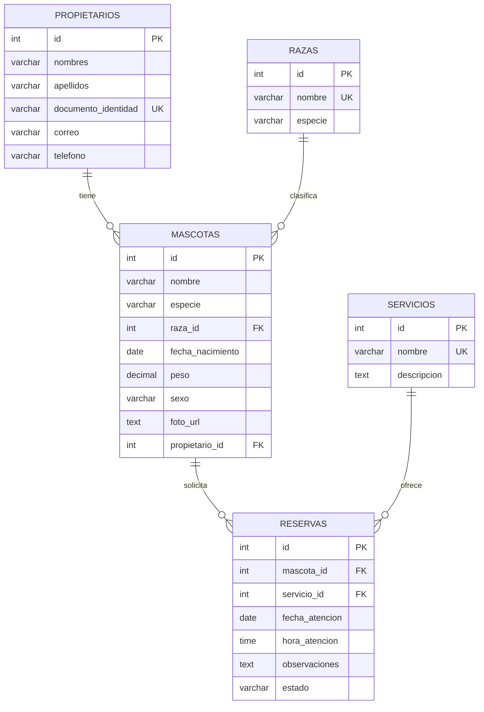

# PetCare Services - Sistema de Gestión de Mascotas y Reservas

Este proyecto es la solución completa para el examen de recuperación de **Desarrollo de Soluciones en la Nube**. Consiste en una aplicación web estructurada en **3 capas** y dockerizada para un despliegue rápido y consistente en cualquier entorno local o en la nube (AWS, GCP, Azure).

---

## 1. Arquitectura de la Solución (3 Capas)

La aplicación sigue una arquitectura clásica de 3 capas para mantener el código limpio, desacoplado y fácil de mantener:

```mermaid
graph TD
    subgraph Capa_Presentacion [Capa de Presentación (Frontend)]
        UI[Navegador / HTML + CSS + JS]
    end
    
    subgraph Capa_Logica [Capa de Lógica de Negocio (Backend)]
        API[Controlador Flask - app.py]
        Val[Validaciones & Lógica - business.py]
        DogAPI[Dog API externa - dog.ceo]
    end
    
    subgraph Capa_Datos [Capa de Acceso a Datos]
        DB_Helper[Manejador SQL - database.py]
        MySQL[(Base de Datos MySQL)]
    end

    UI <-->|Fetch API / JSON| API
    API <--> Val
    Val <--> DB_Helper
    Val -.->|Consulta Razas| DogAPI
    DB_Helper <-->|PyMySQL Connection Pool| MySQL
```

---

## 2. Modelo de Base de Datos (Entidad-Relación)

A continuación se muestra el diseño físico de las tablas relacionales:



---

## 3. Flujo de Datos Paso a Paso

1.  **Carga de Razas (Inicialización):** Al arrancar el servidor Flask, este consulta `https://dog.ceo/api/breeds/list/all`, formatea los nombres de las razas y los almacena automáticamente en la tabla `razas` en MySQL. También inicializa razas por defecto de gatos.
2.  **Registro de Propietario / Mascota / Reserva:**
    *   El usuario ingresa los datos en el formulario HTML (Capa de Presentación).
    *   JavaScript captura el evento `submit`, valida preliminarmente que los campos requeridos estén llenos y los envía mediante un método POST en formato JSON a la API REST de Flask (`app.py`).
    *   La Capa de Lógica de Negocio (`business.py`) intercepta el request, realiza validaciones (ej. formato de correo, documento único, fecha no futura, peso mayor a cero) y, si cumple las reglas de negocio, solicita al motor de datos (`database.py`) su inserción.
    *   La Capa de Datos establece la conexión con el servidor MySQL e inserta el registro usando sentencias parametrizadas (protección contra SQL Injection).
    *   Se retorna el ID del nuevo elemento insertado, viajando de vuelta por las capas en una respuesta JSON exitosa. El Frontend limpia el formulario y recarga la lista.

---

## 4. Requisitos Previos

Asegúrate de tener instalados los siguientes componentes:
*   [Docker](https://www.docker.com/) y [Docker Compose](https://docs.docker.com/compose/)
*   O si prefieres ejecutar localmente sin Docker:
    *   [Python 3.10+](https://www.python.org/)
    *   Un servidor local de MySQL (ej. XAMPP o MySQL Server)

---

## 5. Instrucciones de Ejecución Paso a Paso

### Opción A: Con Docker (Recomendado y Requerido para el Examen)

1.  Abre una terminal o consola de comandos en la carpeta del proyecto (`petcare_app`).
2.  Inicia la aplicación y la base de datos en segundo plano mediante:
    ```bash
    docker compose up -d --build
    ```
3.  Este comando descargará la imagen oficial de MySQL 8.0, construirá la imagen del contenedor web y levantará la aplicación de forma automática enlazando ambos contenedores.
4.  Abre tu navegador web e ingresa a: **`http://localhost:5000`**
5.  Para detener y eliminar los contenedores sin borrar los datos guardados, ejecuta:
    ```bash
    docker compose down
    ```

### Opción B: Ejecución Local de Desarrollo (Sin Docker)

1.  Asegúrate de que tu servidor MySQL local esté corriendo. Crea una base de datos vacía llamada `petcare_db`.
2.  Crea y configura tu archivo `.env` según el archivo `.env.example`:
    ```env
    PORT=5000
    DB_HOST=localhost
    DB_PORT=3306
    DB_USER=tu_usuario_mysql
    DB_PASSWORD=tu_contraseña_mysql
    DB_NAME=petcare_db
    BREEDS_API_URL=https://dog.ceo/api/breeds/list/all
    ```
3.  Instala las dependencias del proyecto:
    ```bash
    pip install -r requirements.txt
    ```
4.  Inicia el servidor Flask:
    ```bash
    python app.py
    ```
5.  Accede a la aplicación en `http://localhost:5000`.

---

## 6. Guía de Despliegue en la Nube (AWS, GCP, Azure)

Para desplegar la solución en una máquina virtual de cualquier proveedor en la nube, sigue este procedimiento estándar:

1.  **Publicar la imagen en un Registro (Docker Hub):**
    *   Inicia sesión en Docker Hub desde tu consola local: `docker login`
    *   Construye la imagen con tu tag de Docker Hub:
        ```bash
        docker build -t tu_usuario_dockerhub/petcare-web:latest .
        ```
    *   Sube la imagen al registro:
        ```bash
        docker push tu_usuario_dockerhub/petcare-web:latest
        ```

2.  **Preparar la Instancia Cloud (por ejemplo, AWS EC2):**
    *   Lanza una instancia virtual (Ubuntu Server 22.04 LTS).
    *   Configura el **Grupo de Seguridad** para abrir los siguientes puertos entrantes (Inbound Rules):
        *   Puerto `22` (SSH) para administración.
        *   Puerto `80` (HTTP) o `5000` (Puerto de la App) para acceso público de usuarios.
    *   Conéctate a la máquina por SSH.
    *   Instala Docker y Docker Compose en la máquina virtual:
        ```bash
        sudo apt update
        sudo apt install -y docker.io docker-compose
        sudo systemctl start docker
        sudo systemctl enable docker
        ```

3.  **Despliegue en la Máquina Virtual:**
    *   Crea un directorio `petcare/` en la máquina virtual y añade los archivos `docker-compose.yml` y `.env` en dicho directorio.
    *   En el archivo `docker-compose.yml` de producción, actualiza la propiedad `build: .` del servicio `web` por:
        `image: tu_usuario_dockerhub/petcare-web:latest`
    *   Levanta los servicios en la nube:
        ```bash
        sudo docker-compose up -d
        ```
    *   Accede al sistema usando la IP pública de la máquina virtual: `http://<IP-PUBLICA>:5000`.
